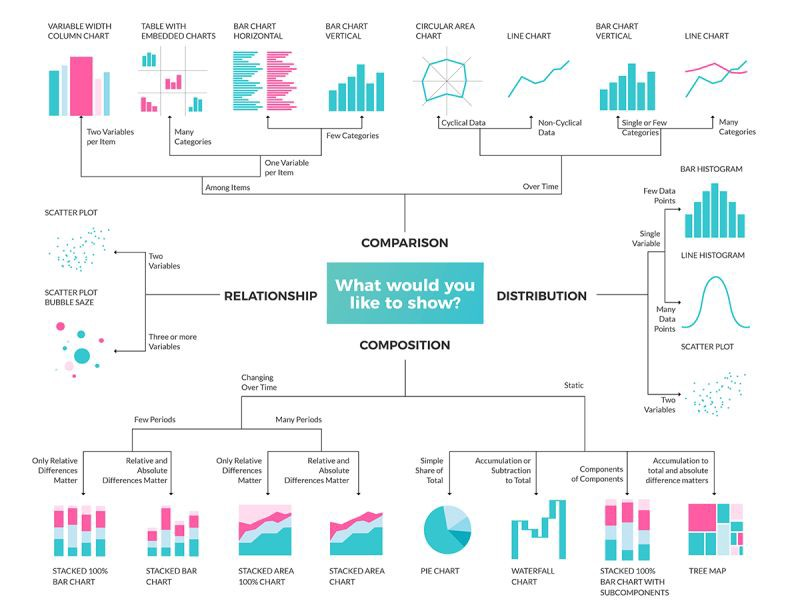

### Overview & Setup

1. Go to the `CS3 Project 2.4` assignment on **Blackbaud** and follow the provided **GitHub Classroom** link.
  > 📁 Clicking the link generates a **private repository** for your project with the appropriate starter code. Note that **projects** are stored within the [BWL-CS Organization](https://github.com/BWL-CS), so you _cannot_ access it from the "Your Repositories" page!
2. Open the repository in a **Codespace** whenever you spend time working on the program, in class or at home. 
  > ⚠️ Always remember to `commit changes` after every coding session!
3. When your project is complete, **submit the link to your repository** in the `CS3 Project 2.4` assignment on Blackbaud.

This is a cumulative project focusing on **Exploratory Data Analysis (EDA)** using Python's `pandas`, `matplotlib`, and `seaborn` libraries. The project aims to demonstrate skills in data wrangling, visualization, and communication of findings through a scientific conference-style poster. You will work with a dataset of your choice to perform EDA. The project consists of three main deliverables: A descriptive **`README.md`** file, code in a **`main.py`** script, and a Scientific Conference Poster. 

#### Dataset Sources:
- [Kaggle](https://www.kaggle.com/)
- [UCI Machine Learning Repository](https://archive.ics.uci.edu/ml/index.php)
- [Data.gov](https://www.data.gov/)

---

### Deliverable Details

##### ① `README.md` file must include the following:

[ ] **Dataset**:
  - Provide a link to the dataset you chose. You may use platforms like Kaggle, UCI Machine Learning Repository, or government open data portals.
[ ] **Column Descriptions**:
  - Write a brief description of each column in your dataset. Include data types and potential values.
[ ] **Hypotheses/Questions**:
  - List at least 5 questions you want to explore using your dataset. _Examples:_
    - Is there a correlation between two variables?
    - How do values in a specific column change over time or categories?
[ ] **Visualization Plan**:
  - Explain how you will use visualizations to test your hypotheses. Include the type of chart you plan to use for each question.

##### ② `main.py` script must:

[ ] **Load & process the dataset**:
  - Handle missing values.
  - Rename columns if necessary for clarity.
  - Convert data types if needed.
  - Filter and/or group data for focused analysis.
[ ] Contain code for at least **4 different types of visualizations**:
  - Examples include:
    - Bar plot
    - Scatter plot
    - Pie chart
    - Heatmap
    - Box plot
  - Ensure each visualization is well-labeled with titles, axis labels, and legends.
[ ] Be thoroughly **commented**:
  - Explain the purpose of each section of the code.
  - Use functions for reusable components of your code.

##### ③ Use this [Google Slide Template](https://docs.google.com/presentation/d/1IkrIYBNTEBLFIO7kqUJWvrWhzRuiYhXyX7lxNZglkpU/edit?usp=sharing) for the scientific conference poster, which must include the following sections:

[ ] **Introduction**:
  - Context for the dataset and why it is interesting/relevant.
  - Clearly state your research questions or hypotheses.
[ ] **Methods**:
  - Describe your process for cleaning and analyzing the data.
  - Include screenshots of key Python code snippets.
[ ] **Results**:
  - Present 2–3 visualizations from your analysis.
  - Provide clear captions for each figure.
[ ] **Discussion**:
  - Interpret your findings and discuss patterns or trends observed in the data.
  - Mention any limitations of your analysis.
[ ] **Conclusions**:
  - Summarize key takeaways.
  - Suggest potential areas for future research or data exploration.
[ ] **References**:
  - Cite the dataset and any external resources (_research on the topic for your poster's Introduction and/or Discussion sections_).

---

### Choosing the Right Visualizations

Choosing the appropriate visualization is crucial for effectively communicating your findings. Here are guidelines to help you decide:

1. **Understand the Nature of Your Data**
  - **Categorical Data**:
    - Use **bar plots** or **pie charts** to show proportions or comparisons between categories.
  - **Numerical Data**:
    - Use **histograms** or **box plots** to display distributions.
    - Use **scatter plots** to show relationships between two numerical variables.
  - **Time-Series Data**:
    - Use **line plots** to show trends over time.

2. **Match the Visualization to Your Question**
  - **Comparisons Across Groups**:
    - Bar plots or grouped bar plots work well.
    - Consider box plots if comparing distributions between groups.
  - **Relationships Between Variables**:
    - Scatter plots are ideal for two numerical variables.
    - Heatmaps can show correlations between multiple variables.
  - **Proportions**:
    - Pie charts or stacked bar plots can highlight proportions within a whole.
  - **Trends**:
    - Line plots are best for visualizing trends over time or sequential events.

3. **Highlight Key Insights**
  - Use color and annotations sparingly but effectively to emphasize critical points.
  - Avoid clutter by focusing on the most relevant data.

4. **Keep Accessibility in Mind**
  - Ensure your visualizations are easy to interpret:
    - Include clear titles, axis labels, and legends.
    - Choose color palettes that are colorblind-friendly (e.g., Seaborn's default palette).

#### Example Chart Selection Table

| **Question Type**              | **Recommended Chart Type**       |
|--------------------------------|----------------------------------|
| Proportions                    | Pie chart, Stacked bar plot      |
| Trends over time               | Line plot                        |
| Distribution of a variable     | Histogram, Box plot              |
| Comparison across categories   | Bar plot, Grouped bar plot       |
| Relationships between variables| Scatter plot, Heatmap            |

---

### Requirements & Grading Criteria

- **Completeness**:
  - All deliverables are submitted.
  - Each section of the `README.md` is detailed and insightful.
  - The Python script performs meaningful analysis and includes diverse visualizations.
  - The poster contains all required sections with a professional presentation.
- **Code Quality**:
  - Code is well-organized, with comments and function definitions.
  - Visualizations are clear and informative.
- **Communication**:
  - The poster effectively communicates the key findings.
  - Captions and text are concise and relevant.

